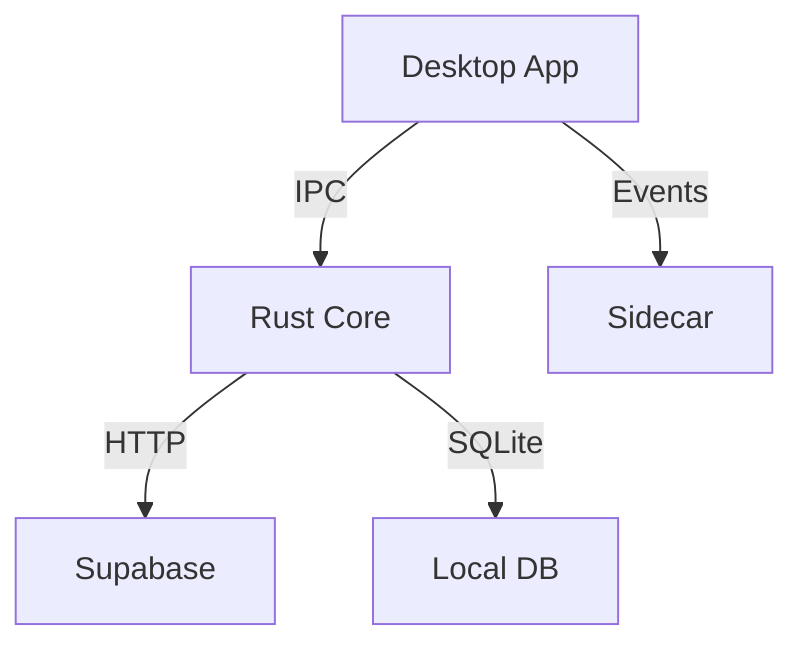
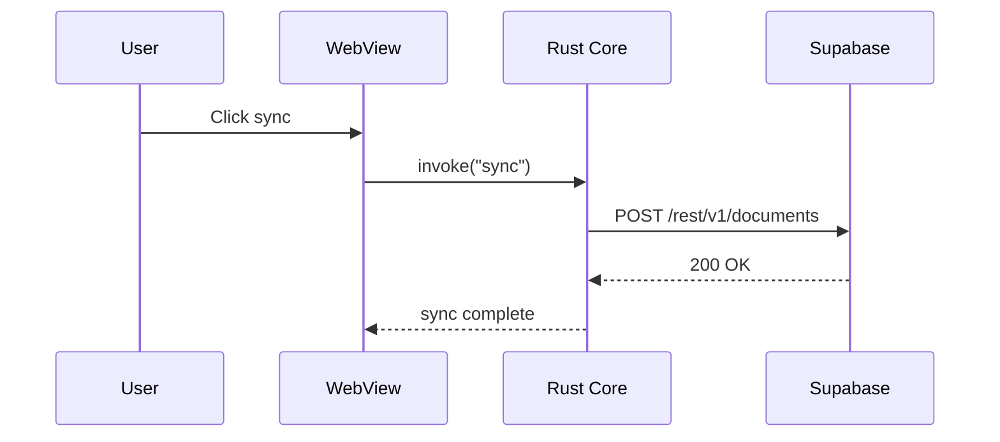

# Architecture Documentation

## C4 Model: Four Zoom Levels

```
Level 1: System Context    -- "What systems exist and who uses them?"
Level 2: Container          -- "What deployable units make up the system?"
Level 3: Component          -- "What modules/services live inside a container?"
Level 4: Code               -- "What classes/functions implement a component?"
```

### Level 1: System Context

Shows the system as a box, surrounded by users and external systems.

```
+----------+      +-----------------+      +------------+
|  User    | ---> |  Our System     | ---> | Supabase   |
| (Person) |      | (Desktop + API) |      | (External) |
+----------+      +-----------------+      +------------+
                         |
                         v
                  +-------------+
                  | OAuth       |
                  | Provider    |
                  +-------------+
```

Ask: Who are the users? What external systems do we depend on? What does the system do at the highest level?

### Level 2: Container

Shows deployable/runnable units inside the system boundary.

```
+--------------------------------------------------+
|  System Boundary                                  |
|                                                   |
|  +-------------+    +-------------+               |
|  | Desktop App |    | Sidecar     |               |
|  | (Tauri)     |--->| (Go binary) |               |
|  +-------------+    +-------------+               |
|       |                  |                        |
|       v                  v                        |
|  +-------------+    +------------------+          |
|  | Local SQLite|    | Supabase Edge    |          |
|  | (embedded)  |    | Functions        |          |
|  +-------------+    +------------------+          |
+--------------------------------------------------+
```

Each box = separate process, deployable unit, or data store. Include technology in parentheses.

### Level 3: Component

Inside one container, show the major structural pieces.

```
+-------------------------------------------+
|  Desktop App (Tauri)                      |
|                                           |
|  +----------+  +----------+  +---------+  |
|  | UI Layer |  | Sync     |  | Auth    |  |
|  | (React)  |  | Engine   |  | Module  |  |
|  +----------+  +----------+  +---------+  |
|       |             |             |       |
|  +----------+  +----------+  +---------+  |
|  | State    |  | Conflict |  | Keyring |  |
|  | Manager  |  | Resolver |  | Access  |  |
|  +----------+  +----------+  +---------+  |
+-------------------------------------------+
```

### Level 4: Code

Usually auto-generated (UML from code). Rarely worth documenting manually. Reserve for complex algorithms or critical data structures.

### When to Use Each Level

| Level | Audience | Update Frequency |
|---|---|---|
| Context | Everyone, stakeholders | Quarterly or major change |
| Container | Dev team, ops, new hires | Monthly or new container |
| Component | Dev team working on container | Per feature/sprint |
| Code | Individual developer | Rarely (auto-generate if needed) |

## Architecture Decision Records (ADR)

### MADR Template

```markdown
# ADR-NNNN: [Decision Title]

## Status
[Proposed | Accepted | Deprecated | Superseded by ADR-XXXX]

## Date
YYYY-MM-DD

## Context
[What is the problem? What constraints exist? What forces are at play?]

## Decision
[What did we decide? Be specific.]

## Options Considered

| Option | Pros | Cons |
|---|---|---|
| Option A | Fast, simple | Limited scalability |
| Option B | Scalable, proven | Complex setup |
| Option C | Cheap | Vendor lock-in |

## Consequences

### Positive
- [What improves]

### Negative
- [What gets harder, what trade-offs we accept]

### Neutral
- [Side effects, things to monitor]
```

### When to Write an ADR

| Scenario | Write ADR? |
|---|---|
| Choose database technology | Yes |
| Pick a UI framework | Yes |
| Select a design pattern (e.g., CQRS) | Yes |
| Resolve a trade-off with significant impact | Yes |
| Decide on API versioning strategy | Yes |
| Choose between two npm packages for date formatting | No |
| Follow an established team convention | No |

Rule of thumb: if someone will ask "why did we do it this way?" in 6 months, write an ADR.

### ADR Lifecycle

```
Proposed --> Accepted --> [Deprecated | Superseded by ADR-XXXX]
```

- Never delete ADRs -- they are a decision log
- Superseded ADRs link to the new one
- Store in: `docs/decisions/NNNN-slug.md` (e.g., `docs/decisions/0001-use-tauri-for-desktop.md`)
- Number sequentially, never reuse numbers

### ADR Example

```markdown
# ADR-0003: Use SQLCipher for Local Database Encryption

## Status
Accepted

## Date
2026-03-15

## Context
Desktop app stores sensitive user data locally. Need encryption at rest.
OS-level encryption (FileVault/BitLocker) is not guaranteed enabled.

## Decision
Use SQLCipher (encrypted SQLite) with key stored in OS keychain.

## Options Considered

| Option | Pros | Cons |
|---|---|---|
| SQLCipher | Transparent encryption, drop-in SQLite | Slightly larger binary |
| Application-level AES | Full control | Must handle all edge cases |
| Rely on OS disk encryption | No code changes | Not guaranteed enabled |

## Consequences
- Positive: data encrypted even without OS disk encryption
- Negative: ~5-10% query overhead, larger binary size
- Neutral: key rotation strategy needed for future versions
```

## Diagramming Tools

### Decision Matrix

| Tool | Stored In | Renders In | Best For |
|---|---|---|---|
| Mermaid | Markdown files | GitHub, Notion, VS Code | In-repo diagrams, CI-friendly |
| Structurizr DSL | `.dsl` files | Structurizr web/CLI | C4 architecture-as-code |
| ASCII art | Any text file | Everywhere | Reference files, comments |
| Excalidraw | `.excalidraw` files | Excalidraw app, VS Code | Collaborative whiteboarding |
| PlantUML | `.puml` files | PlantUML server | Sequence diagrams, class diagrams |

### Mermaid Examples





### ASCII Diagram Conventions (For Reference Files)

```
Use these characters:
  +---+  Box corners and edges
  |   |  Vertical lines
  --->   Directional arrow
  <-->   Bidirectional arrow
  ...>   Async / eventual
  [  ]   Named entity
  (  )   Technology note
```

## Documentation Hierarchy

### What Goes Where

| Document | Content | Read Time | Update Trigger |
|---|---|---|---|
| `README.md` | What the project is, how to run it | 30 seconds | Major changes |
| `docs/project-overview-pdr.md` | Project goals, scope, stakeholders | 5 minutes | Phase changes |
| `docs/system-architecture.md` | C4 context + container diagrams | 5 minutes | Architecture changes |
| `docs/codebase-summary.md` | Module map, key patterns | 10 minutes | New modules |
| `docs/decisions/*.md` | ADRs | As needed | Each decision |
| `docs/code-standards.md` | Coding conventions, linting | 5 minutes | Convention changes |
| Code comments | Why (not what) | Inline | With code changes |

### Documentation Anti-Patterns

| Anti-Pattern | Problem | Fix |
|---|---|---|
| Documenting implementation | Duplicates code, goes stale | Document decisions and intent |
| Stale diagrams | Mislead developers | Review in PRs, auto-generate |
| No audience clarity | Too detailed or too vague | State audience at top of doc |
| Over-documenting | More docs != better | Write only what someone will read |
| Separate wiki | Drifts from code | Keep docs in repo |
| Screenshots of architecture | Cannot update, no search | Use text-based diagrams |

## Keeping Docs Alive

### Strategies

1. **Review in PRs** -- if code changes architecture, require doc update
2. **Link from code** -- `// See docs/decisions/0003-sqlcipher.md` in source
3. **Auto-generate** -- API docs from OpenAPI, type docs from code
4. **Ownership** -- each doc has an owner (team or person)
5. **Freshness date** -- add `Last reviewed: YYYY-MM-DD` to key docs
6. **CI checks** -- broken links, orphaned ADRs, missing required sections

### PR Checklist for Documentation

```markdown
- [ ] New ADR needed? (technology choice, pattern selection, trade-off)
- [ ] Architecture diagram still accurate?
- [ ] README still reflects how to run the project?
- [ ] Codebase summary updated for new modules?
- [ ] Code comments explain "why" for non-obvious logic?
```

## Common Pitfalls

| Pitfall | Impact | Fix |
|---|---|---|
| No ADRs | Decisions lost, repeated debates | Write ADR for every significant choice |
| Code-level docs only | No big picture | Maintain C4 context + container |
| Docs in external tool | Drift from code | Keep in repo, link externally |
| Documenting "what" | Redundant with code | Document "why" and "trade-offs" |
| Monolithic architecture doc | Never updated | Split into focused documents |
| No diagram standard | Inconsistent visuals | Pick one tool (Mermaid), stick to it |
